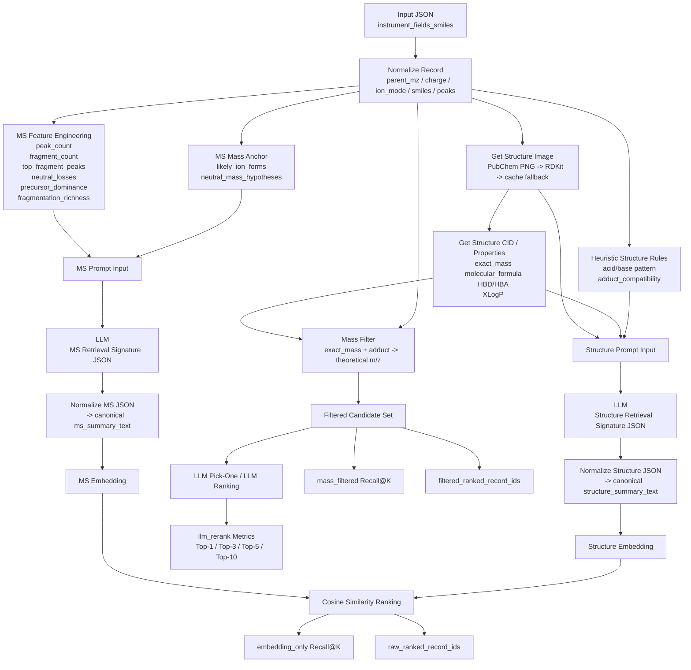

# Retrieval Pipeline Analysis

## 1. 目标与整体思路

当前系统的目标是完成一个跨模态检索任务：

- 查询端：`MS/MS` 仪器数据
- 候选库端：`SMILES + 2D structure image`
- 检索目标：给定一个质谱样本，在结构库中找到对应的正确化学结构

这套方法不是直接将原始 `ms` 峰表和 `smiles` 做向量化，而是采用三步式建模：

1. 确定性特征提取
2. LLM 生成检索签名
3. embedding 检索 + mass filter

因此，它本质上是一个：

`MS retrieval signature -> Structure retrieval signature -> embedding alignment`

的检索框架。

---

## 2. 当前代码主流程

主入口：

- `llm_embedding_pipeline.py`
- `casmi_pipeline/cli.py`

主流程如下：

1. 读取精简输入文件
2. 规范化记录字段
3. 对 `ms` 峰表做统计与摘要
4. 估计 MS 侧质量锚点与 adduct 假设
5. 为 `smiles` 获取结构图片
6. 为结构侧生成确定性特征
7. 分别构造 `MS prompt` 和 `SMILES prompt`
8. 调用两个 LLM，分别生成两个 JSON 检索签名
9. 将 JSON 规范化为稳定文本
10. 对两类文本做 embedding
11. 计算 `MS -> Structure` 相似度
12. 返回每个 query 的 `raw` 与 `filtered` 候选 id 排名序列
13. 额外进行基于精确质量的 mass filter
14. 可选地对 top-k 候选执行 LLM rerank
15. 输出 `embedding_only`、`mass_filtered` 与 `llm_rerank` 结果

---

## 3. MS 侧 Prompt 采用的特征

MS 侧 Prompt 的目标不是生成“实验分析报告”，而是生成“适合检索的谱图签名”。

对应代码：

- `casmi_pipeline/prompts.py`
- `casmi_pipeline/preprocess.py`
- `casmi_pipeline/summaries.py`

### 3.1 输入到 MS Prompt 的原始字段

输入字段来自：

- `parent_mz`
- `charge`
- `ms_level`
- `ion_mode`
- `ion_source`
- `instrument`
- `scan`
- `peak_summary`
- `mass_anchor`

其中真正有检索价值的核心是：

- `parent_mz`
- `charge`
- `ion_mode`
- `top_fragment_peaks`
- `neutral_losses`
- `precursor_dominance`
- `fragmentation_richness`

### 3.2 MS 侧确定性特征工程

`peak_summary` 由 `summarize_peaks()` 提取，包含：

- `peak_count`
- `fragment_peak_count`
- `base_peak`
- `precursor_peak`
- `top_peaks`
- `top_fragment_peaks`
- `neutral_losses`
- `precursor_dominance`
- `fragmentation_richness`

### 3.3 质量锚点

`mass_anchor` 由 `infer_ms_mass_anchor()` 提取，包含：

- `likely_ion_forms`
- `neutral_mass_hypotheses`

这里使用了 adduct 规则表，对给定 `parent_mz + charge + ion_mode` 推导可能的中性质量。

### 3.4 MS Prompt 输出的目标字段

MS Prompt 固定输出：

- `mass_anchor`
- `spectrum_profile`
- `chemical_hints`
- `retrieval_terms`

这样做的目的是：

- 限制模型输出格式
- 减少不同大模型的风格差异
- 把自由文本压缩为稳定、短、可对齐的签名

### 3.5 最终进入 embedding 的 MS 文本

最终真正进 embedding 的字段是：

- `precursor_mz`
- `charge`
- `ion_mode`
- `likely_ion_forms`
- `neutral_mass_hypotheses`
- `peak_count`
- `fragment_peak_count`
- `precursor_dominance`
- `fragmentation_richness`
- `top_fragments_mz`
- `neutral_losses`
- `chemical_hints`
- `retrieval_terms`

### 3.6 MS 侧设计的优点

- 保留了最核心的谱图辨识信息
- 不再依赖长篇自由分析文本
- 质量信息被显式建模
- 中性丢失和代表性碎片被保留下来

### 3.7 MS 侧当前局限

- `Ion_Source / Instrument / Scan / ms_level` 在当前 CASMI 子集里几乎是常量，区分能力弱
- 稀疏谱图时，`top_fragment_peaks` 和 `neutral_losses` 的信息量本身有限
- 当前没有显式建模 isotope pattern、peak entropy、fragment co-occurrence

---

## 4. SMILES 侧 Prompt 采用的特征

SMILES 侧 Prompt 的目标不是“化学性质报告”，而是“结构检索签名”。

对应代码：

- `casmi_pipeline/prompts.py`
- `casmi_pipeline/structure_features.py`
- `casmi_pipeline/images.py`
- `casmi_pipeline/summaries.py`

### 4.1 输入到 Structure Prompt 的信息

输入包括：

- `smiles`
- `image_status`
- `image_source`
- `derived_structure_features`

### 4.2 结构图片来源

结构图片获取逻辑：

1. 优先根据 `smiles` 查询 PubChem CID
2. 再下载 PubChem 官方 PNG
3. 如果失败，则尝试 RDKit 本地渲染
4. 若已有缓存，则直接复用
5. 若 `force=True` 且外网失败，则回退到本地缓存图

图片本身不直接进入 embedding，而是作为结构侧 LLM 的辅助上下文。

### 4.3 结构侧确定性特征

`build_structure_features()` 提供以下确定性特征：

- `molecular_formula`
- `exact_mass`
- `hbd`
- `hba`
- `xlogp`
- `xlogp_class`
- `heteroatom_signature`
- `adduct_compatibility`

这些特征优先来自 PubChem property API。

### 4.4 结构侧启发式规则

当前系统还根据 SMILES 模式做了简单结构规则判断：

- 酸性位点模式
- 碱性位点模式
- adduct compatibility

例如：

- 酸性结构倾向于兼容 `[M-H]-`
- 碱性结构倾向于兼容 `[M+H]+`
- 杂原子较多时允许更宽的 adduct 候选

### 4.5 Structure Prompt 输出的目标字段

Structure Prompt 固定输出：

- `consistency_check`
- `structure_profile`
- `fragmentation_priors`
- `retrieval_terms`

其中重点包括：

- `scaffold`
- `ring_system`
- `heteroatom_signature`
- `functional_groups`
- `acid_base_class`
- `shape_class`
- `likely_losses`
- `fragile_bonds`

### 4.6 最终进入 embedding 的 Structure 文本

最终真正进 embedding 的字段是：

- `smiles`
- `exact_mass`
- `molecular_formula`
- `heteroatom_signature`
- `hbd`
- `hba`
- `xlogp_class`
- `adduct_compatibility`
- `consistency_check`
- `scaffold`
- `ring_system`
- `functional_groups`
- `acid_base_class`
- `shape_class`
- `likely_losses`
- `fragile_bonds`
- `retrieval_terms`

### 4.7 Structure 侧设计的优点

- 补上了旧方案中缺失的质量锚点
- 分子式与异原子信息能帮助与 MS 侧质量约束对齐
- 把图像作用限制在“辅助结构校验”而不是主导检索
- 结构签名字段固定，更适合 embedding

### 4.8 Structure 侧当前局限

- `exact_mass / formula / HBD / HBA` 依赖 PubChem 可用性
- 当前缺少 RDKit 本地 descriptor fallback
- `adduct_compatibility` 仍然是启发式规则，不是严格电离模型
- `smiles` 原文直接进入 embedding，可能引入分词层面的偏置

---

## 5. Adduct 体系与质量建模

当前系统已经补齐了 21 类 adduct 定义。

核心配置在：

- `casmi_pipeline/settings.py`

### 5.1 两层 adduct 结构

第一层：

- `ADDUCT_21D_MAPPING`

用于固定 adduct 编号映射。

第二层：

- `ADDUCT_SPECS`

每个 adduct 都包含：

- `multiplier`
- `delta`
- `charge`
- `mode`

因此现在支持：

- 单电荷
- 多电荷
- 二聚体
- 加铵、加钠、加钾
- 甲酸/乙酸/氯加合
- 失水离子

### 5.2 当前实际用于质量过滤的 adduct

虽然 21 类已经定义完整，但当前 mass filter 默认仍使用保守的 primary 集合：

正离子：

- `[M+H]+`
- `[M+Na]+`
- `[M+NH4]+`
- `[M+K]+`
- `[M]+`
- `[M+H-H2O]+`

负离子：

- `[M-H]-`
- `[M+Cl]-`
- `[M+HCOOH-H]-`
- `[M+CH3COOH-H]-`

这是一个务实折中：

- 好处：不会把候选池放得过宽
- 坏处：某些真实 adduct 若不在 primary 集合里，会被过滤掉

---

## 6. 过滤逻辑

当前检索不是只靠 embedding，而是两级筛选：

1. embedding similarity
2. mass filter

在新版实现中，还增加了可选的第三层：

3. LLM rerank

### 6.1 embedding_only

直接对：

- `ms_embeddings`
- `structure_embeddings`

做 cosine similarity，得到原始排名。

### 6.2 mass_filtered

`candidate_mask_for_query()` 的逻辑是：

1. 读取 query 的：
   - `parent_mz`
   - `ion_mode`
   - `charge`
2. 根据 `ion_mode + charge` 选一个默认 adduct 池
3. 对每个结构候选：
   - 读取 `exact_mass`
   - 对每个 adduct 计算理论 `m/z`
   - 若与 query 的 `parent_mz` 误差小于容差，则保留
4. 用保留下来的候选重新排序

### 6.3 理论 `m/z` 计算公式

当前实现公式为：

`mz = (multiplier * exact_mass + delta) / |charge|`

这比旧版 `exact_mass + delta` 更正确。

### 6.4 质量过滤的作用

这层是当前提升 Top-1 最关键的逻辑之一，因为它能直接剔除：

- 分子量差几十 Da
- 分子量差上百 Da

但 embedding 语义上又“看起来像同一家族”的错误候选。

### 6.5 返回的排名序列

当前 `evaluate_retrieval()` 除了返回汇总 Recall@K，还会返回每个 query 的完整候选顺序：

- `raw_ranked_record_ids`
- `filtered_ranked_record_ids`
- `raw_rank`
- `filtered_rank`
- `candidate_count_after_mass_filter`

这样后续可以直接做：

- Top-k 候选分析
- LLM pick-one
- LLM full ranking
- 错误样本诊断

### 6.6 LLM rerank

当前系统支持两种 LLM 重排模式：

1. `pick-one`
   从 top-k 候选中只选择 1 个最可能匹配的结构
2. `full-ranking`
   对 top-k 候选给出完整排序

二者都可以基于：

- `embedding_only` 候选池
- `mass_filtered` 候选池

当前实现默认会同时计算两种候选池。

如果只想单独跑一支，也可以显式指定：

- `embedding_only`
- `mass_filtered`

通常更推荐优先关注：

- `mass_filtered`

因为它先利用质量约束缩小搜索空间，再让 LLM利用结构和碎片一致性做细排。

---

## 7. End-to-End 流程图

---

## 8. 当前方案的优点

### 8.1 相比旧版更适合检索

旧版问题：

- 更像写分析报告
- 文本太长
- 模型风格差异太大
- 质量信息没有稳定进入结构侧表示

新版改进：

- Prompt 固定 schema
- embedding 文本字段固定
- 质量锚点加入结构侧
- 加入 adduct-aware mass filter

### 8.2 对 Top-1 更友好

Top-1 差的一个核心原因，是很多错误候选在语义上“像同一家族”，但质量明显不对。

mass filter 能直接切掉这类错误。

### 8.3 工程上更清晰

现在已经形成清晰分层：

- feature extraction
- prompt generation
- llm signature generation
- summary canonicalization
- embedding
- retrieval evaluation
- reranking evaluation

---

## 9. 当前仍然不合理的地方

### 9.1 API key 仍建议只通过环境变量传入

当前实现已经允许从环境变量读取 API key，但为了进一步降低风险，仍建议长期只保留：

- `COMMONSTACK_API_KEY`

而不要在 CLI 层保留任何默认明文值。

### 9.2 评估仍依赖行号对齐

`evaluate_retrieval()` 当前默认第 `i` 个 MS 对应第 `i` 个结构。

在当前封闭数据集上可用，但不适合扩展到：

- 打乱样本顺序
- 合并多个数据集
- 大规模候选库

更合理的做法是保留稳定主键，例如：

- `spectrum_id`
- `fn`
- `candidate_id`

### 9.3 combined embedding 尚未参与最终检索

当前虽然生成了：

- `ms_embeddings`
- `structure_embeddings`
- `combined_embeddings`

但评估时只使用了 `ms_embeddings -> structure_embeddings`。

### 9.4 结构确定性特征依赖网络

如果 PubChem 查询失败：

- `exact_mass`
- `molecular_formula`
- `HBD`
- `HBA`

都会退化成 `unknown`，这会直接削弱 mass filter。

### 9.5 mass filter 仍是“硬过滤”

当前做法是：

- 满足质量约束 -> 保留
- 不满足 -> 丢弃

更稳健的做法通常是：

- 先过滤
- 再按质量误差打分
- 与 embedding similarity 融合做 rerank

### 9.6 结构图像不是独立实验模态

当前图像来自：

- PubChem 图
- RDKit 渲染

本质上仍是从 `smiles` 派生出来的结构表示，不是额外观测模态。

因此：

- 它能帮助 LLM稳定理解结构拓扑
- 但不能当成真正独立的新增实验信号

### 9.7 LLM rerank 受候选池上限约束

如果正确答案本身不在 top-k 候选池中，那么：

- `pick-one` 不可能选对
- `full-ranking` 也不可能把它排回前列

因此在解释 LLM rerank 结果时，必须同时报告：

- `candidate_pool_oracle_accuracy`

---

## 10. 推荐的下一步优化

### 10.1 优先级最高

1. 去掉硬编码 API key
2. 给结构侧加 RDKit 本地 descriptor fallback
3. 保留稳定主键，替换当前 index-based evaluation
4. 将 `mass filter` 升级为 `mass-aware reranking`
5. 对 LLM rerank 引入更细粒度的质量误差和碎片一致性辅助特征

### 10.2 检索质量优化

建议最终得分采用加权融合：

- `embedding_similarity`
- `mass_consistency_score`
- `fragmentation_consistency_score`

例如：

- `final_score = 0.45 * embedding + 0.35 * mass + 0.20 * fragmentation`

### 10.3 MS 侧可继续增强的特征

- peak entropy
- binned spectrum
- isotope pattern
- fragment co-occurrence
- diagnostic neutral loss categories

### 10.4 Structure 侧可继续增强的特征

- ring count
- aromatic ring count
- TPSA
- formal charge
- fingerprint-based scaffold tags
- rule-based acidic/basic center counts

---

## 11. 总结

当前方案已经从“LLM 生成化学分析报告”演进成了“LLM 生成检索签名”的框架。

它的核心价值在于：

- 用确定性特征稳定约束两侧输入
- 用 LLM 把数值谱图与结构拓扑压缩到同一种可比较语义空间
- 用质量过滤弥补 embedding 不能精确比较分子量的缺陷

如果目标是做一个可解释、零训练成本的 baseline，这个方案是成立的。

如果目标是进一步提升 Top-1，那么后续重点不应再放在“让 Prompt 更像分析报告”，而应放在：

- 更强的质量约束
- 更细粒度的碎片一致性建模
- 更可靠的结构侧确定性特征
- 更合理的 reranking 设计
